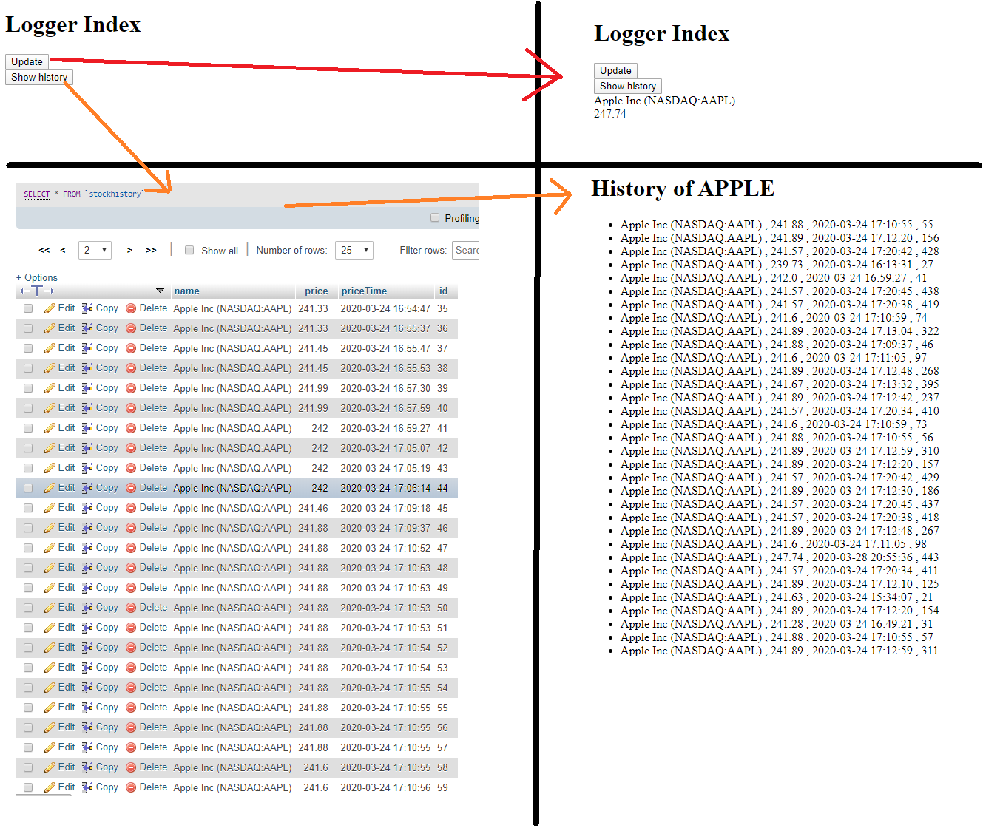

# Stock Market Logger
Stock Market Logger logs price of Apple stock. At current stage only one stock is set, however extention to more stocks is supported and easily implementable.

Stock Market Logger fetch data about Apple stock current price and exact time (timestamp). Then the data are stored in the database. Finally, the web app allows to show all records stored in the database.

This JAVA Web application using some of the advanced JAVA features.

## Installation
1. MySQL DB setup

```SQL
-- create a user for DB
UPDATE mysql.user SET Password=PASSWORD('') WHERE User='root';
-- create a database
CREATE testDB;
-- select a databe that will be used
USE testDB;

-- create a single table to track 
CREATE TABLE stockHistory(
	name VARCHAR(32),
	price DOUBLE,
    priceTime DEFAULT CURRENT_TIMESTAMP ON UPDATE CURRENT_TIMESTAMP,
	id INT UNSIGNED NOT NULL AUTO_INCREMENT PRIMARY KEY );
```
2. Run Java app

## Tutorial


## Technologies
* Tomacat 9.0
* JAVA 13
* JSTL
* JDBC
* Maven
* MVC concept

## License
Proprietary. All rights reserved.